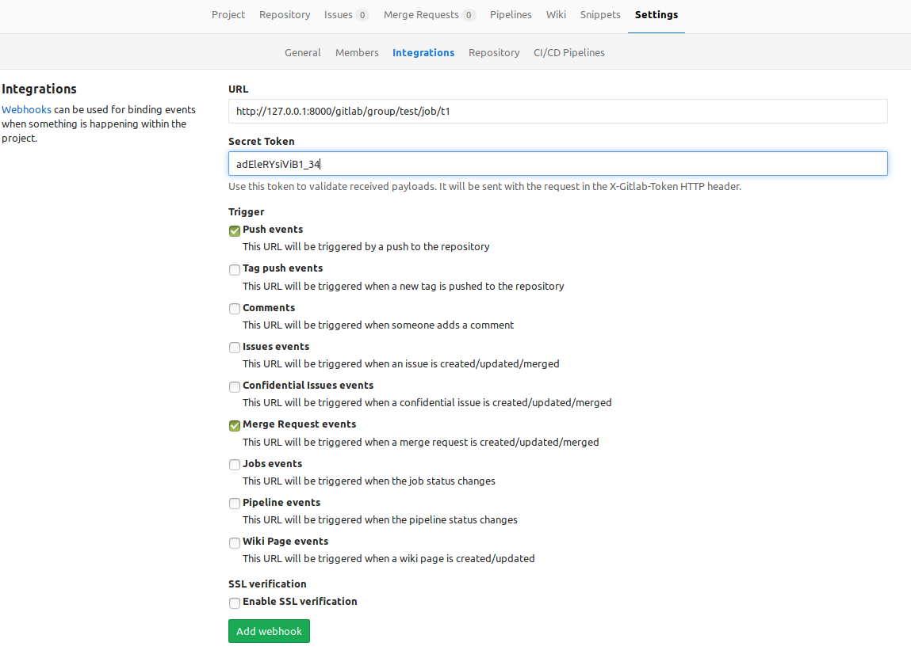
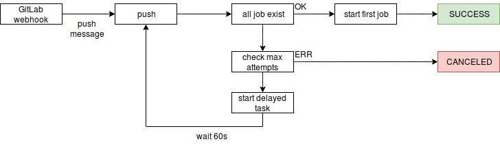

# jenkins-gitlab-integrator

Server for integration GitLab CE with Jenkins (in last version GitLab (9.x) integration with jenkins enable only in EE version).

Server works only with multibranch pipeline jobs (maybe i will implement non-multibranch pipeline)

How it work:
* every  push starts build in jenkins (if the branch does not already exist, then the server will try to start the job until it reaches the limit of attempts or build starts.)
* for each merge request server checks the build and write comment about status

Menu:

* [Usage](#usage)
  * [Install requirements libs](#usage_install_libs)
  * [Configure database schema](#usage_config_db)
  * [Configure server](#usage_config_server)
  * [Example group config](#usage_example_group)
  * [Example Gitlab webhook](#usage_gitlab_webhook)
  * [Exec server](#usage_exec_server)
  * [Admin UI](#usage_admin_ui)
  * [App stats](#usage_stats)
* [Development](#development)
  * [Prepare dev machine](#development_prepare_dev)
  * [Prepare DB](#development_db)
  * [Libs](#development_libs)
  * [GitLab webhook processing](#development_gitlab_webhook)


## <a name="usage"></a> Usage

### <a name="usage_install_libs"></a> Install requirements libs
```
pip install -r requirements.txt
```

### <a name="usage_config_db"></a> Configure database schema

Edit alembic.ini , set sqlalchemy.url for connect database

Run migrations `alembic upgrade head`

```
vim alembic.ini
alembic upgrade head
```

### <a name="usage_config_server"></a> Configure server

config:
```
host: 0.0.0.0 # listen address
port: 8000 # listen port
log_level: INFO # log level
session_secret: W4GVt6aQql1iT2YC5f8z98jsB2xwm9KroHsrQSiFrgI= # salt for cookies
#user list
users:
  - username: root
    password: root
    token: adEleRYsiViB
    superuser: yes # Disable restrictions for this user

  - username: gitlab_bot
    password: gitlab_bot
    token: adEleRYsiViB1_34 #token for api auth , gitlab Private-Token header !!! All token must be unique
    permission: [GITLAB_HOOKS] # allow access to GITLAB_HOOKS

  - username: admin
    password: password
    permission: [ADMIN_UI] # allow access to admin ui

#mysql connection, same as alembic.ini
mysql:
  db: jenkins_integrator
  host: 127.0.0.1
  user: root
  password: test
  port: 3306
  minsize: 5
  maxsize: 5

#gitlab api config
gitlab:
  url: https://gitlab.example.local #gitlab url
  access_token: xc3PXwfWxaKMdAM8yyzc #gitlab user api token (look to gitlab docs)

#background workers config
workers:
  enable: yes #enable or disable run workers
  max_attempts: 10000 # how many try for do task
  scan_timeout: 60 # period between task run

jenkins: #settings for jenkins
  user_id: sergey.kravchuk #jenkins user
  api_token: 2342b01c0dceca0465d144e310893ba9 # jenkins api token
  groups: # groups jobs
    testproject: # name of group
      jobs_base_path: https://jenkins.example.local/job/experments #base job path for group
      first_job: testproject #first job for run
      chains: #chains of jobs
        default: #chain name
          - testproject #job in chain
          - testprojectendstep
    test2:
      jobs_base_path: https://jenkins.example.local/job/test2
      first_job: test
      chains:
        default:
          - test
          - test2
```

### <a name="usage_example_group"></a> Example group config


```
  groups:
    test:
      jobs_base_path: https://jenkins.example.local/job/test
      first_job: t1
      chains:
        default:
          - t1
          - t2
          - t3
```

gitlab webhook `http://server:port/gitlab/group/test/job/t1` or

`http://server:port/gitlab/group/test/job/t2` or

`http://server:port/gitlab/group/test/job/t3`


```
  groups:
    appd:
      jobs_base_path: https://jenkins.example.local/job/appd
      first_job: t1
      chains:
        d1:
          - t1
          - t2
          - t3
          - d1
        d2:
          - t1
          - t2
          - t3
          - d2
        d3:
          - t1
          - t2
          - t3
          - d3
```

gitlab webhook `http://server:port/gitlab/group/appd/job/{job_name}`

### <a name="usage_gitlab_webhook"></a> Example Gitlab webhook




### <a name="usage_exec_server"></a> Exec server
```
python -m server.main -c /path/to/config/server.yml
```

### <a name="usage_admin_ui"></a> Admin UI

Admin UI provide:
 * management for delayed tasks
 * show current config & version

```
Go to http://server:port/login
```

### <a name="usage_stats"></a> App stats

`http://server:port/stats` return json with stats.

```
{
    "coroutines_run": 2, # current execute coroutines
    "task_in_queue": 0, # count task with status new
    "app_version": "1.0.0"
}
```

## <a name="development"></a> Development

### <a name="development_prepare_dev"></a>  Prepared dev machine
```
apt-get install -y python3-dev python3 python3-venv
#init sandbox
python3 -m venv ~/py-sandbox/py3/server-jenkins-notify-py3
#use sandbox
source ~/py-sandbox/py3/server-jenkins-notify-py3/bin/activate
#install requirements
pip install -r requirements.txt
```

### <a name="development_db"></a> Prepare DB
```
#create database
create database jenkins_integrator DEFAULT CHARACTER SET utf8;

vim alembic.ini
alembic upgrade head
```

### Run test
```
make test
```

### <a name="development_libs"></a> Libs
* [https://github.com/aio-libs/aiohttp]
* [https://github.com/aio-libs/aiomysql]
* [http://alembic.zzzcomputing.com/en/latest/]
* [https://pypi.python.org/pypi/aiodns]
* [https://www.sqlalchemy.org/]
* [https://pypi.python.org/pypi/trafaret]
* [http://jinja.pocoo.org/docs/2.9/]
* [https://github.com/aio-libs/aiohttp-security]
* [https://github.com/aio-libs/aiohttp-session]
* [https://pypi.python.org/pypi/cryptography]


### <a name="development_gitlab_webhook"></a> Gitlab webhook processing

#### Push processing



#### Mege processing


